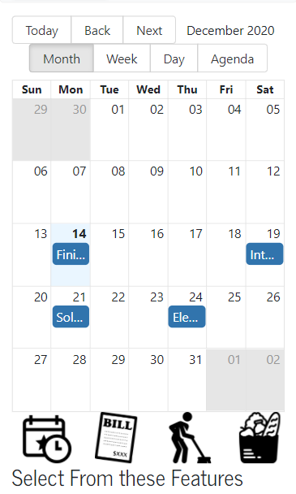
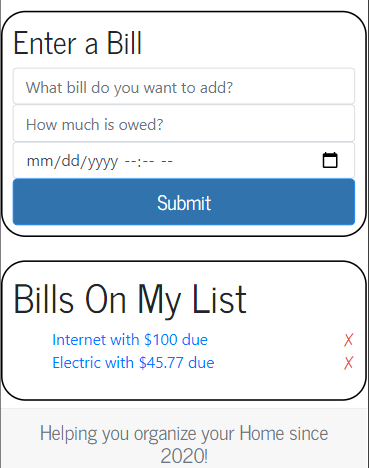
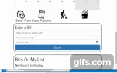
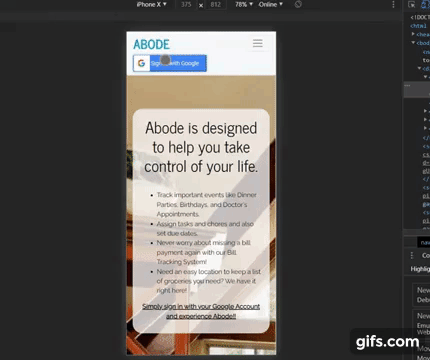

# Abode

Link of Deployed App: https://home-management-app.herokuapp.com/home

Link to GitHub Repo: https://github.com/dktrcoco/HomeImprovement

Table of Contents
* [User Story](#story)
* [Images](#images)
* [Gifs](#gifs)
* [Install](#install)
* [Instructions](#instructions)
* [Contribution](#contribution)
* [Authors](#authors)
* [Questions](#questions)
* [Future Work](#future)
* [Retrospective](#retrospective)

## Story

AS a Homeowner, I want one location where I can track my household bills, chores, groceries, etc

SO I can quickly and easly find and maintain that information and get reminders when certain things need to be completed.

GIVEN a User who wants one location to track Bills, Events, Chores, and Groceries

WHEN a User navigates to ABODE

THEN they land on the home page, which contains a description of the app and how it works

WHEN a User logs in using their Google Account

THEN they are rerouted to the primary components of the App

WHEN a User is logged in via their Google Account

THEN the image associated with their account will display in the Nav Bar

WHEN a User is logged in

THEN they are given access to the calendar display and input fields for Events, Chores, Bills, and Groceries

WHEN a User inputs data

THEN it will immediately display in a list below and on the calendar above on the appropriate day

WHEN a User wants to switch to a different input and they click on one of the other options

THEN the corresponding input fields will render along with the list of any existing items from that field

WHEN a User wants a reminder of the App description

THEN that information is viewable in the collapsible Nav Bar

WHEN a User is done and wants to log out

THEN they click on the sign out button and they are rerouted to the Home page

## Images

Fig. 1: Calendar Display

Fig. 2: Bill Input with List of Existing Bills

## Gifs

Gif 1: Bill Data Input and Deletion

Gif 2: Cycling between Input Options

Gif 3: Logging In/Logging Out

## Install

No installation is required, simply navigate to the deployed app.

If you want to check out the code, you will need to clone the repo and run 'npm install' to ensure the module packages/dependencies are installed.

## Contribution

Pull requests are welcome. For major changes, please open an issue first to discuss what you would like to change.

Please make sure to update tests as appropriate.

## Authors

Chris Kabana (chris.kabana@gmail.com, https://github.com/dktrcoco)

Christian Vadevoulis (christian.vadevoulis@gmail.com, https://github.com/CVade)

Shonta Wilson (swilson9894@gmail.com, https://github.com/swilson9894)

Matt Dudzik (mdudzik92@gmail.com, https://github.com/Mdudzik92)

## Questions

If you have any questions that are not answered, please feel free to reach out to any of us at our email (listed above). 

You can also reach us through GitHub directly via our accounts (listed above).

## Future

-assign chores to specific users (dad cleans garage, kid feeds Fido)
-Mark off if a chore has been completed
-‘Gamification’ of chores
-Color code Events, Chores, Bills differently
-Color code chores by category
-Include api calls for weather to influence recommendations for outdoor chores
-Add multiple log-ins
-Add multiple authentication level types
-SMS messages between users
-Allow for integration of existing Google Calendars
-Implement various carousel videos that change based on the season or other variable (like weather)
-When a user clicks on an item in their grocery list, several recipes incorporating that item are displayed
-Integration of your Google calendar to this calendar for easy migration
-Include api call when you click on a grocery item and a list of several recipes that include that item will display

## Retrospective

-Shonta: 

-Chris: This project was a lot of work but I am significantly more confident in my abilities regarding MERN stack development. Additionally, I feel confident finding an npm package for something I need (cookie parser and react-rounded-image for a couple examples I found and utilized for this project). I definitely need to practice some of the more complicated (to me) concepts but I feel I am now a capable full-stack developer with high potential for growth.

I've worked with each of the other teammates in previous projects so we already had a rapport together. This proved very helpful during the development process. I've enjoyed my time working with everyone on this project and I wish everyone success and good fortune!

-Matt:

-Christian: